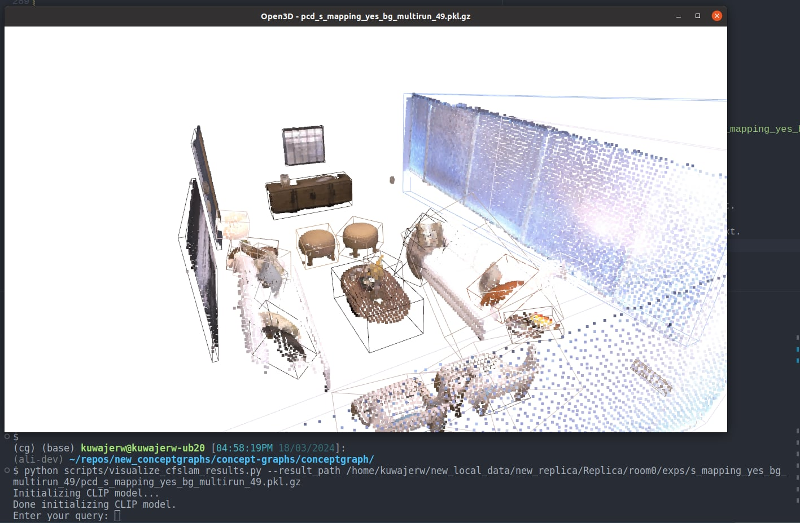
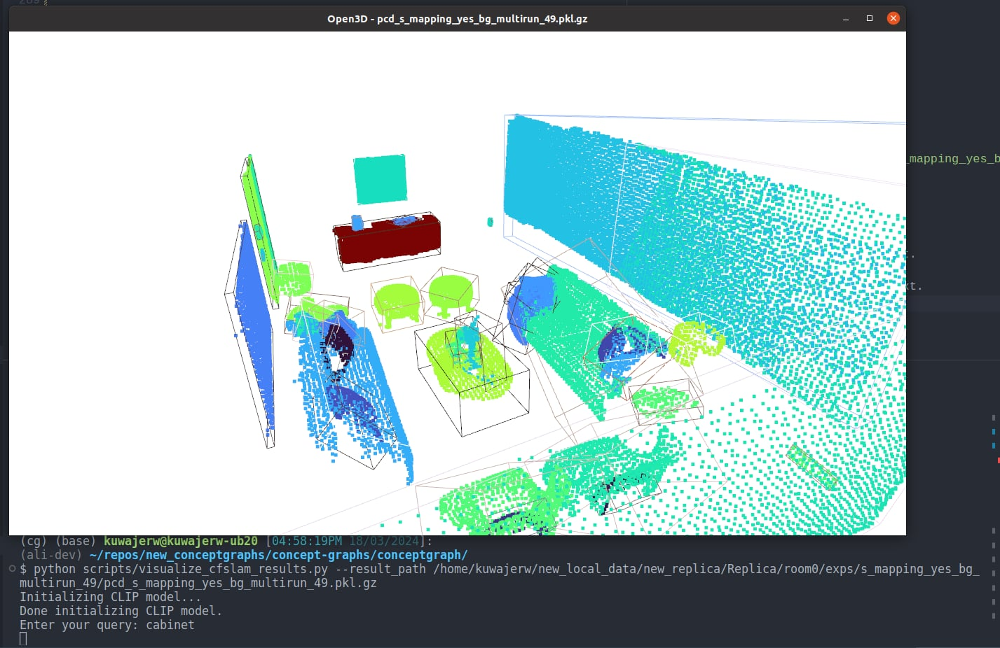

# ConceptGraphs: Open-Vocabulary 3D Scene Graphs for Perception and Planning

This repository contains the code for the ConceptGraphs project. ConceptGraphs builds open-vocabulary 3D scenegraphs that enable a broad range of perception and task planning capabilities.

## Requirements
This was done on Ubuntu 20.04 with cuda 12.1 and python 3.10.

## Setup
Navigate to concept-graphs repo and create a virtual environment.
```bash
git clone https://github.com/ArghyaChatterjee/concept-graphs.git
cd concept-graphs
python3.10 -m venv concept_graph_venv
source concept_graph_venv/bin/activate
pip3 install --upgrade pip
pip3 install -r requirements.txt
pip3 install -e .
```

## IPhone Demo Run

### Using an iPhone as RGB-D sensor

For this, you'll need to use the Record3D app. The scans you make using the app can be exported to an `.r3d` file. You can then use googledrive or a usb cable or something else to get the `.r3d` file on to your computer. Then right click -> extract out it's contents into a folder, and you'll probably wanna rename the folder to a convenient name. 

Run the script:
```bash
cd concept-graphs/conceptgraph/dataset/
python3 preprocess_r3d_file.py` 
```
This will convert that initial extracted r3d files into a dataset (RGB, Depth & Pose) that conceptgraphs can use. In the `preprocess_r3d_file.py`, set the datapath variable to your extracted r3d folder. 

### Data Directory Structure
```
concept-graphs
├── data
│   └── record3d_scans
│       └── ihmc_room_scan
│           ├── conf
|           |     └── 0.png
│           |     ├── ...
│           ├── conf_images
|           |     └── 0.png
│           |     ├── ...
│           ├── dataconfig.yaml
│           ├── depth
|           |     └── 0.png
│           |     ├── ...
│           ├── high_conf_depth
|           |     └── 0.png
│           |     ├── ...
│           ├── poses
|           |     └── 0.npy
│           |     ├── ...
│           └── rgb
|           |     └── 0.png
│           |     ├── ...
```

### Setting up configuration 
[hydra](https://hydra.cc/) package is used to manage the configuration, so you don't have to give it a bunch of command line arguments, just edit the  entries in the corresponding `.yaml` file in `./conceptgraph/hydra_configs/` and run the script.

For example here is my `./conceptgraph/hydra_configs/rerun_realtime_mapping.yaml` file:

```yaml
defaults:
  - base
  - base_mapping
  # - replica
  - record3d
  - sam
  - classes
  - logging_level
  - _self_

detections_exp_suffix: s_detections_stride_10_run2 # just a convenient name for the detection run
force_detection: !!bool False
save_detections: !!bool True

use_rerun: !!bool True
save_rerun: !!bool True

stride: 10
exp_suffix: r_mapping_stride_10_run2 # just a convenient name for the mapping run
```

First the values are loaded from `base.yaml`, then `base_mapping.yaml` (internally loads `base_paths.yaml`) then `record3d.yaml`, then `sam.yaml`, then `classes.yaml` and then, `logging_level.yaml` and `__self__` is the file itself. If there is a conflict (i.e. two files are modifying the same config parameter), the values from the earlier file are overwritten. i.e. `record3d.yaml` will overwrite any confliting values in `base.yaml` and so on.

Finally `_self_` is loaded, which are te values in `rerun_realtime_mapping.yaml` itself. This is where you can put your own custom values. Also feel free to add your own `.yaml` files to `./conceptgraph/hydra_configs/` and they will be loaded in the same way.

`force_detection: !!bool False`: The force_detection flag is used to determine whether the object detection process should be explicitly re-run, regardless of whether previous detection results already exist. It essentially overrides the logic that skips detection if results are available, ensuring that the detection process is performed again.

`save_detections: !!bool True`: The save_detections flag controls whether the detection results should be saved to disk after they are computed during the object detection process. This flag ensures that the outputs of detection, such as bounding boxes, masks, and associated metadata, are stored for later use, visualization, or debugging.

#### Paths
Update this in the `./conceptgraph/hydra_configs/base.yaml` file. For me, it is:
```yaml
defaults:
  - override hydra/job_logging: custom_logging_format

use_wandb: !!bool False
use_rerun: !!bool False
```
Update this in the `./conceptgraph/hydra_configs/base_paths.yaml` file. For me, it is:
```yaml
repo_root: /home/arghya/concept-graphs
data_root: /home/arghya/concept-graphs/data
```
Update this in the `./conceptgraph/hydra_configs/record3d.yaml` file. For me, it is:
```yaml
defaults:
  - base_paths
  
dataset_root: ${data_root}/record3d_scans
scene_id: isr_lab_room_scan_2024-12-20--12-22-25
dataset_config: ${dataset_root}/${scene_id}/dataconfig.yaml
render_camera_path: ${repo_root}/conceptgraph/dataset/dataconfigs/record3d/record_3d_camera.json
```
Update this in the `./conceptgraph/hydra_configs/sam.yaml` file. For me, it is:
```yaml
sam_variant: sam # sam
sam_encoder_version: "vit_l"
sam_checkpoint_path: /home/arghya/concept-graphs/conceptgraph/slam/sam_l.pt
mobile_sam_path: /home/arghya/concept-graphs/conceptgraph/slam/mobile_sam.pt
```

### Building the map

To build the map, simply run the following command from the `conceptgraph` directory:

```bash
cd concept-graphs/conceptgraph/slam
python3 rerun_realtime_mapping.py
```

Note that if you don't have the models installed, it should just automatically download them for you.

### Save Mapping and Detection Results
The results are saved in the corresponding dataset directory, in a folder called `exps`. It will name the folder with the `exp_suffix` you set in the configuration file, and also save a `config_params.json` file in that folder with the configuration parameters used for the run.

**NOTE:** For convinience, the script will also automatically create a symlink `/concept-graphs/latest_pcd_save` -> `Replica/room0/exps/r_mapping_stride_10_run2/pcd_r_mapping_stride_10_run2.pkl.gz` so you can easily access the latest results by using the `latest_pcd_save` path in your argument to the visualization script.

Here is what the ouput of running the mapping script looks like for `room0` in the `Replica` dataset:

```bash
.
./Replica # This is the dataset root
./Replica/room0 # This is the scene_id
./Replica/room0/exps # This parent folder of all the results from conceptgraphs

# This is the folder for the run's detections, named according to the exp_suffix
./Replica/room0/exps/s_detections_stride_10_run2 

# This is where the visualizations are saved, they are images with bounding boxes and masks overlayed
./Replica/room0/exps/s_detections_stride_10_run2/vis 

# This is where the detection results are saved, they are in the form of pkl.gz files 
# that contain a dictionary of the detection results
./Replica/room0/exps/s_detections_stride_10_run2/detections 

# This is the mapping output folder for the specific run, named according to the exp_suffix
./Replica/room0/exps/r_mapping_stride_10_run2/
# This is the saved configuration file for the run
./Replica/room0/exps/r_mapping_stride_10_run2/config_params.json
# We also save the configuration file of the detection run which was used 
./Replica/room0/exps/r_mapping_stride_10_run2/config_params_detections.json
# The mapping results are saved in a pkl.gz file
./Replica/room0/exps/r_mapping_stride_10_run2/pcd_r_mapping_stride_10_run2.pkl.gz
# The video of the mapping process is saved in a mp4 file
./Replica/room0/exps/r_mapping_stride_10_run2/s_mapping_r_mapping_stride_10_run2.mp4
# If you set save_objects_all_frames=True, then the object mapping results are saved in a folder
./Replica/room0/exps/r_mapping_stride_10_run2//saved_obj_all_frames
# In the saved_obj_all_frames folder, there is a folder for each detection run used, and in each of those folders there is a pkl.gz file for each object mapping result
./Replica/room0/exps/r_mapping_stride_10_run2/saved_obj_all_frames/det_exp_s_detections_stride_10_run2

```

## Running the visualization script

This script allows you to vizluatize the map in 3D and query the map objects with text. The `latest_pcd_save` symlink is used to point to the latest mapping results, but you can also point it to any other mapping results you want to visualize.

```bash
cd concept-graphs/scripts/
python3 visualize_cfslam_results.py \
    --result_path latest_pcd_save 
```

or if you'd like to point it to a specific result, you can just point it to the pkl.gz file directly:

```bash
cd concept-graphs/scripts/
python3 visualize_cfslam_results.py \
    --result_path /path/to/data/Replica/room0/exps/r_mapping_stride_10_run2/pcd_r_mapping_stride_10_run2.pkl.gz
```

## Searching the map with text

Then in the open3d visualizer window, you can use the following key callbacks to change the visualization. 
* Press `b` to toggle the background point clouds (wall, floor, ceiling, etc.). Only works on the ConceptGraphs-Detect.
* Press `c` to color the point clouds by the object class from the tagging model. Only works on the ConceptGraphs-Detect.
* Press `r` to color the point clouds by RGB. 
* Press `f` and type text in the terminal, and the point cloud will be colored by the CLIP similarity with the input text. 
* Press `i` to color the point clouds by object instance ID. 

Here is what it looks like to search for "cabinet" in the Replica `room0` scene.

First we run the script, and then press `f` to trigger the `Enter your query:` input 



And then we can type `cabinet` and press enter, and the point cloud will be colored by the CLIP similarity with the input text.




## Streaming the map directly from an iPhone as you're doing the scan

If you'd like to skip the dataset making process and build the map in near real time as you're recording the scan, you can use the `concept-graphs/conceptgraph/slam/r3d_stream_rerun_realtime_mapping.py` script for that, it's also covered in the getting started video. First you need to setup the record3D git repo, which requires installing cmake. After that, simply use the [USB streaming option](https://record3d.app/features) in the Record3D app, and then run the `r3d_stream_rerun_realtime_mapping.py` script to start building the map immediately. So that's:
```
sudo apt install cmake
```
and then, with your `conceptgraph` conda environment active, run these commands from the record3D github [README file](https://github.com/marek-simonik/record3d?tab=readme-ov-file#python)
```
git clone https://github.com/marek-simonik/record3d
cd record3d
python setup.py install
```
and now you can run the `r3d_stream_rerun_realtime_mapping.py` same as the previous scripts. Of course, you will have to have the iPhone streaming via USB to your computer at the same time when you run the script.
```bash
cd /path/to/code/concept-graphs/conceptgraph/
python /slam/r3d_stream_rerun_realtime_mapping.py
```

## Debugging

We've commited a pre-made vscode debug config file to the repo to make debugging simple. You can find it at `concept-graphs/.vscode/launch.json`. Here you'll find launch commands to run the core scripts talked about in this README. If you're not familiar with the vscode debugger, check out the getting started video, or the vscode [docs](https://code.visualstudio.com/docs/python/debugging).


## Misc

To stop a script early, you can use the `concept-graphs/conceptgraph/hydra_configs/early_exit.json` file. If you set `early_exit: true` in the file, then the script will exit early after the current iteration is finished. This is useful if you want to stop the script early, but still save the results from the current iteration.

# Classes File

The classes file is used as a set of class labels to the object detection model. This is a tradeoff between sacrificing some "open-vocabulary-ness" for more stable detections. We have two classes files avaiable:
```bash
concept-graphs/conceptgraph/scannet200_classes.txt
concept-graphs/conceptgraph/ram_classes_4500.txt
```
The scannet classes are the labels from the [scannet200 dataset](https://rozdavid.github.io/scannet200).
The ram classes are the tags from the [RAM model](https://recognize-anything.github.io/).


## Troubleshooting

Sometimes for X11 or Qt related errors, I had to put this in my bashrc file to fix it 
    
```bash
export XKB_CONFIG_ROOT=/usr/share/X11/xkb
```

That's all for now, we will keep updating this README with more information as we go.
